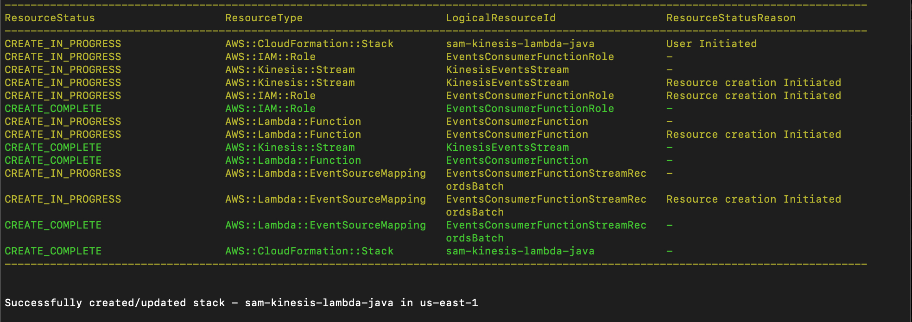

# AWS Lambda Kinesis Consumer for Cart Events

This project contains source code and supporting files for a serverless application that you can deploy with the SAM CLI.
The Java application serves as an AWS Lambda function to consume cart events from an Amazon Kinesis stream. It mimicks processing incoming events and logs the details of each cart event.

## Consumer Variation

This AWS Lambda Kinesis Consumer is an alternative variation of the [consumer built using the Java KCL (Kinesis Client Library)](https://github.com/ssuljo/aws-kcl-consumer.git). While the Java KCL consumer provides a different way to consume and process cart events, the Lambda-based consumer offers the advantages of serverless execution and easier deployment.

### Consumer Comparison

| Feature                                 | Java KCL Consumer                                 | AWS Lambda Consumer                         |
|-----------------------------------------|---------------------------------------------------|--------------------------------------------|
| **Execution Environment**               | Standalone Java application                      | AWS Lambda function                         |
| **Scalability**                         | Manual scaling by adding instances                | Auto-scales based on event volume            |
| **Deployment Ease**                     | Requires EC2 instances setup and management       | Simplified deployment using AWS SAM CLI     |
| **Advanced Features**                   | Distributed stream processing capabilities        | Real-time event processing                   |
| **Checkpointing**                       | Custom checkpointing with KCL libraries           | Automatic checkpointing by AWS Lambda       |
| **Monitoring and Logging**              | Custom configuration and monitoring                | Integrated with AWS CloudWatch              |
| **Cost Consideration**                  | Potential EC2 instance costs                      | Pay-as-you-go pricing with Lambda            |
| **Use Case**                            | Complex processing, custom requirements           | Real-time event processing, ease of deployment |

**Java KCL Consumer:**

- Suitable for complex processing requirements.
- Provides advanced features and control over stream processing.
- Requires manual scaling and management of EC2 instances.
- Custom checkpointing and monitoring configurations.

**AWS Lambda Consumer:**

- Designed for real-time event processing.
- Auto-scales based on event volume.
- Simplified deployment using AWS SAM CLI.
- Integrated with AWS CloudWatch for monitoring.

## Project Structure
The project includes the following files:

### `CartAbandonmentEvent`
- Represents a cart abandonment event with information about cart items, customer ID, seller ID, and timestamp.

### `CartItem`
- Represents an individual item within a shopping cart, including product name, product code, quantity, and price.

### `EventsManager`
- Manages cart abandonment events, calculates average order sizes, and (potentially) sends users notifications.

### `EventsConsumer`
- Code for the application's Lambda function. Implements the AWS Lambda RequestHandler interface to consume and process cart events from an Amazon Kinesis stream.
- De-serializes Kinesis records into CartAbandonmentEvent objects and logs the processed event details.

### `AWS SAM Template` (template.yaml)
- Defines the AWS CloudFormation template for deploying the AWS Lambda function, Kinesis Data Stream and the associated resources.

## Prerequisites
Before deploying and running this project, ensure you have the following prerequisites:

- **AWS Account**: You must have an AWS account to deploy and execute Lambda functions.
- **AWS CLI**: Install and configure the AWS Command Line Interface (CLI) to manage AWS resources and configure your credentials.
- **AWS SAM CLI**: Install the AWS Serverless Application Model (SAM) CLI to package and deploy your Lambda function.
- **Java Development Kit (JDK)**: Ensure you have Java 17 for building the serverless application.
- **Maven**: Install Apache Maven to build and package the Java Lambda function.

## Deployment
To build and deploy the application for the first time, run the following in the shell:

```bash
sam build
sam deploy --guided
```

The first command will build the source of the application. The second command will package and deploy the application to AWS, with a series of prompts:

* **Stack Name**: The name of the stack to deploy to CloudFormation. This should be unique to your account and region, and a good starting point would be something matching your project name.
* **AWS Region**: The AWS region you want to deploy your app to.
* **Confirm changes before deploy**: If set to yes, any change sets will be shown to you before execution for manual review. If set to no, the AWS SAM CLI will automatically deploy application changes.
* **Allow SAM CLI IAM role creation**: Many AWS SAM templates, including this example, create AWS IAM roles required for the AWS Lambda function(s) included to access AWS services. By default, these are scoped down to minimum required permissions. To deploy an AWS CloudFormation stack which creates or modifies IAM roles, the `CAPABILITY_IAM` value for `capabilities` must be provided. If permission isn't provided through this prompt, to deploy this example you must explicitly pass `--capabilities CAPABILITY_IAM` to the `sam deploy` command.
* **Save arguments to samconfig.toml**: If set to yes, your choices will be saved to a configuration file inside the project, so that in the future you can just re-run `sam deploy` without parameters to deploy changes to your application.


## Deployment Output

After successfully deploying the AWS Lambda Kinesis Consumer using the `sam deploy` command, you will see output similar to the following:


Here's a breakdown of what each line represents:

- `AWS::IAM::Role`: The IAM role created for the Lambda function.
- `AWS::Kinesis::Stream`: The Amazon Kinesis stream used by the application.
- `AWS::Lambda::Function`: The AWS Lambda function itself.
- `AWS::Lambda::EventSourceMapping`: The event source mapping between the Lambda function and the Kinesis stream.
- `AWS::CloudFormation::Stack`: The AWS CloudFormation stack that includes all the deployed resources.

This output confirms that the deployment was successful, and all the necessary resources have been created in your AWS environment.
## Usage

The AWS Lambda function (EventsConsumer) will automatically consume cart abandonment events from the specified Kinesis stream. You can view the processed events in the AWS Lambda logs.

## Monitoring

You can monitor the AWS Lambda function's execution, view logs, and set up alerts using AWS CloudWatch.

## Error Handling

The Lambda function includes basic error handling to log errors when de-serializing cart abandonment events. You can extend error handling and logging as needed to suit your specific use case.

## Cleanup

To delete the sample application, use the AWS CLI. Assuming you used your project name for the stack name, you can run the following:

```bash
sam delete --stack-name sam-kinesis-lambda-java
```
